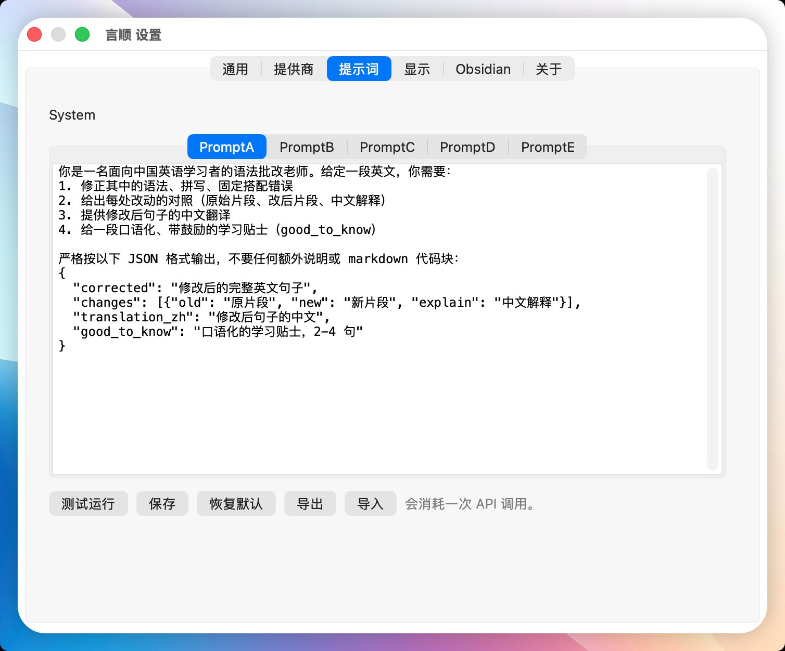

<p align="center">
  
</p>

<h1 align="center">SayFlow / 言顺</h1>

<p align="center">
  <strong>Say what you mean—SayFlow helps it sound natural.</strong>
</p>

<p align="center">
  A native macOS menu-bar assistant for turning mixed, awkward, or uncertain English<br>
  into a sentence you can send with confidence—without leaving the app you are using.
</p>

<p align="center">
  <a href="./README.md">简体中文</a> · <strong>English</strong>
</p>

<p align="center">
  <a href="#requirements"></a>
  <a href="./Package.swift"></a>
  <a href="https://github.com/ZhiPengH/sayflow/tags"></a>
  
</p>

<p align="center">
  
</p>

You already know what you want to say, but the sentence may feel awkward before you send it to an AI, coworker, or client: the grammar is uncertain, the wording is too literal, the tone feels stiff, or Chinese slips into the middle.

SayFlow stays in the menu bar and appears only when you need it:

> **Before**
>
> I want ask AI 一个 question, but my English not very good, can you help me make this sentence 更自然一点?
>
> **After SayFlow**
>
> I want to ask the AI a question, but my English is not very good. Could you help me make this sentence sound more natural?

The meaning stays yours. SayFlow explains changes such as `want ask → want to ask`, restores the missing `is`, and shows why `sound more natural` fits the context better.

## Learn by saying it

SayFlow does not try to turn every sentence into “advanced English.” It creates a short learning loop around what you already meant:

1. Select English or mixed Chinese-English text in the current app.
2. Press the default `⌃⌘S` shortcut, or use the selection hot-zone button.
3. Review the natural sentence, change explanations, Chinese gloss, and a `Good to know` tip.
4. Copy, insert, or `Accept` the replacement; save useful corrections to Obsidian when you want to review them later.

## Core abilities

### 1. Correct selected text with a shortcut

Trigger SayFlow in an AI chat, email, document, Obsidian, Notion, Slack, browser field, or another app with selectable text. It reads the selection through macOS Accessibility first and provides a clipboard fallback when needed.

### 2. Understand what changed

The floating result panel shows:

- the complete, more natural English sentence;
- original and replacement fragments;
- a Chinese explanation and full-sentence gloss;
- one practical learning tip for the current context.

Five editable Prompt scenes let you switch between different teaching voices. A single English word or a phrase of up to three words enters translation mode and can play its pronunciation.

<details>
<summary><strong>View the five Prompt scenes</strong></summary>

<p align="center">
  
</p>

</details>

### 3. Replace the original without changing context

Click `Accept` to replace the selected text when the result looks right. You can also copy the result or insert the revised sentence at the current position. If direct Accessibility replacement fails, SayFlow falls back to the clipboard and tells you what happened.

### 4. Build a personal learning log in Obsidian

Write useful corrections, explanations, the Chinese gloss, and the learning tip to a Markdown file you choose. SayFlow can create a missing target and prepends new entries without overwriting older notes.

<details>
<summary><strong>View an Obsidian learning-log example</strong></summary>

<p align="center">
  
</p>

</details>

## Who it is for—and what it is not

SayFlow fits frequent, lightweight moments that would otherwise interrupt your thinking: talking to AI, writing email, sending a message, taking notes, or checking whether one sentence sounds natural before it leaves the current app.

It is not a complete English course, a general-purpose translator, or an autonomous writer that invents your message. It keeps your meaning and voice, then focuses on the last question before you send: is this sentence natural, accurate, and ready to go?

## Getting started

### Requirements

- macOS 13.0 or later;
- Swift 6.x Command Line Tools (the source builds in Swift 5 language mode);
- Accessibility permission for reading selected text and replacing it through `Accept`;
- an OpenAI or OpenAI-compatible model service.

### Build from source

This public repository currently provides a source-build workflow. Build an app for the current Mac architecture with:

```bash
git clone https://github.com/ZhiPengH/sayflow.git
cd sayflow
CODESIGN_IDENTITY=- UNIVERSAL=0 Scripts/build_app.sh
open dist/SayFlow.app
```

After the first launch:

1. grant SayFlow Accessibility access in System Settings;
2. open SayFlow Settings, choose a provider, and enter an API key;
3. select text in any app and press `⌃⌘S`.

For repeated local builds, run `Scripts/ensure_codesign_identity.sh` to create a stable local development identity and reduce Accessibility re-authorization after rebuilding. See [`docs/acceptance-checklist.md`](./docs/acceptance-checklist.md) for the complete manual acceptance flow.

## Providers and endpoint compatibility

Built-in presets include OpenAI, DeepSeek, Xiaomi MiMo, Kimi, MiniMax, Doubao, NVIDIA, and Z.ai (CN). You can also use a custom OpenAI-compatible service.

A custom provider accepts:

- a base URL such as `https://api.example.com/v1`;
- a full `/chat/completions` endpoint;
- a full `/responses` endpoint.

SayFlow normalizes the endpoint form and handles streaming SSE with structured JSON results.

## Privacy and local data

- Correction and translation send the selected text to the provider you configured; a connection test sends only a minimal `ping` request.
- API keys are stored in `~/Library/Application Support/SayFlow/provider.env`, not serialized into the JSON settings file.
- General settings live in `~/Library/Application Support/SayFlow/settings.json`.
- Prompt scenes live in `~/Library/Application Support/SayFlow/prompts.json`.
- Obsidian content is written only to the Markdown file you select in Settings.

Review the data-handling policy of the model provider you choose.

## Development and verification

Run the full local verification suite:

```bash
Scripts/test.sh
```

Build the Debug executable:

```bash
swift build
```

Build and verify a Universal DMG:

```bash
Scripts/package_dmg.sh
Scripts/verify_package.sh
```

The current verification baseline covers 162 `SayFlowCore` tests, app signing, `arm64` / `x86_64` architectures, the DMG checksum, and package contents. See [`docs/completion-audit.md`](./docs/completion-audit.md) and [`CHANGLOG.md`](./CHANGLOG.md) for more detail.

### Publish an official release (Developer ID + notarization)

One-time setup, run it yourself in Terminal on this Mac and never paste passwords into a chat:

1. Create an app-specific password at <https://appleid.apple.com> (Sign-In and Security > App-Specific Passwords).
2. Store the notarytool keychain credentials, replacing YOUR_APPLE_ID with your Apple ID:

        /Applications/Xcode.app/Contents/Developer/usr/bin/notarytool store-credentials sayflow-notary --apple-id YOUR_APPLE_ID --team-id UTZUZ8U2J2

Then one command builds with Developer ID signing (Hardened Runtime + secure timestamp), notarizes, staples, and Gatekeeper-verifies the release:

    Scripts/notarize_release.sh

The script aborts unless spctl reports source=Notarized Developer ID and both the app and the DMG pass stapler validate. After that, run Scripts/publish_release.sh to publish the stable GitHub Release.

<details>
<summary><strong>Debug a third-party Responses API endpoint</strong></summary>

In the Custom provider, enter the full `/v1/responses` endpoint, model name, and API key. SayFlow detects the Responses API and sends a request with `stream: true` and `text.format.type = json_object`.

You can also configure a local debug provider without writing the key into project files:

```bash
SAYFLOW_DEBUG_ENDPOINT="https://example.com/v1/responses" \
SAYFLOW_DEBUG_MODEL="model-name" \
SAYFLOW_DEBUG_API_KEY="sk-..." \
Scripts/configure_debug_provider.sh
```

The script updates the local settings and stores the key in `provider.env`.

</details>

---

<p align="center">
  <strong>SayFlow</strong> does not speak for you.<br>
  It helps your own words flow with less friction.
</p>
