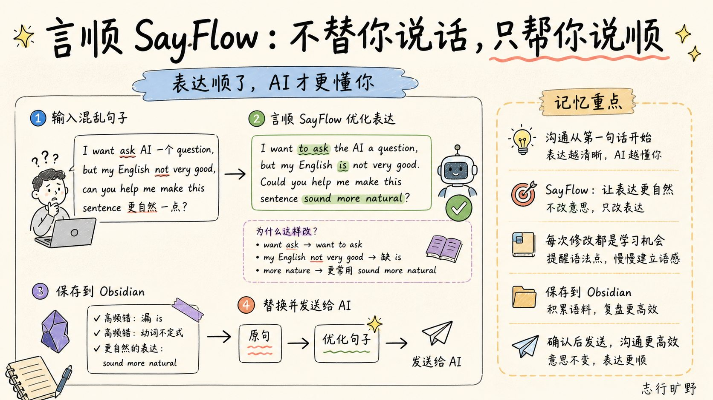

  

<h1 align="center">言顺 SayFlow</h1>

  <strong>不替你说话，只帮你把话说顺。</strong>

  一款驻留菜单栏的原生 macOS 英语表达助手。选中文本，按下快捷键， 
  把中英混杂、语法不稳或不够自然的句子，变成可以放心发出去的英文。

  <strong>简体中文</strong> · <a href="./README.en.md">English</a>

  
  
  
  

  

你大概知道自己想说什么，也能写出一些英文，但真正要发给 AI、同事或客户时，总觉得那句话有点别扭：语法不够稳、词不太达意、语气有点生硬，有时还夹着中文。

言顺不会把你拉进另一个编辑器。它留在菜单栏里，只在你需要时出现：

> **修改前**
>
> I want ask AI 一个 question, but my English not very good, can you help me make this sentence 更自然一点?
>
> **言顺之后**
>
> I want to ask the AI a question, but my English is not very good. Could you help me make this sentence sound more natural?

意思没有变，表达顺了很多。更重要的是，言顺会解释 `want ask → want to ask`、补上缺失的 `is`，并告诉你为什么 `sound more natural` 更符合英语习惯。

## “说中学”：把每次修改变成一次练习

言顺的核心不是替你写一段“高级英文”，而是围绕你原本想表达的意思，完成一个很短的学习闭环：

1. 在当前 App 里选中英文或中英混杂文本。
2. 按下默认快捷键 `⌃⌘S`，或点击选区旁的热区按钮。
3. 查看自然表达、改动解释、中文释义与 `Good to know` 学习贴士。
4. 复制、插入或 `Accept` 替换原文；有价值的内容可以写入 Obsidian。

  

## 核心功能

### 1. 选中文本，快捷修正替换原文本

在 AI 对话框、邮件、文档、Obsidian、Notion、Slack、浏览器输入框等可选中文本的位置，直接唤起言顺（快捷键cmd+ctl+s）。
当你点击accept的时候，它会直接替换你的原文本，当你点中间的+图标，它会追加到原始文本的后面（中英双译效果）

### 2. 不只改句子，也解释为什么

结果弹窗同时展示：

- 更自然、准确的完整英文；
- 原片段与新片段的改动对照；
- 中文解释与整句释义；
- 一条适合当下语境的学习贴士。

你可以维护五组 Prompt 场景，在口语老师、程序员英语老师或自己的教学风格之间快速切换。单个英文单词和短词组会进入翻译模式，并支持发音播放。

<strong>查看五组 Prompt 场景设置</strong>

  

### 3. 一键替换，留在原来的工作流

确认结果合适后，点击 `Accept` 即可替换选中的原文；也可以复制结果，或把修改后的句子插入当前位置。无需来回切换窗口，也不用手动复制粘贴整段内容。

### 4. 写入 Obsidian，建立自己的英语错题本

把值得复盘的句子、改动原因、中文释义和学习贴士写入指定 Markdown 文件。长期积累后，你得到的不是一堆零散答案，而是一套来自自己真实表达的学习语料。

<strong>查看 Obsidian 学习记录示例</strong>

  

## 它适合什么，也不是什么

言顺适合高频、轻量、但容易打断思路的英语表达场景：和 AI 对话、写邮件、发消息、记录笔记，或在任何 App 里临时确认一句话是否自然。

它不是完整的英语学习平台，也不是替你改写所有内容的通用写作机器人。它尽量保留你的意思和声音，只处理表达发出前最关键的问题：这句话是否自然、准确，可以放心发送？

## 开始使用

### 系统要求

- macOS 13.0 或更高版本；
- Swift 6.x Command Line Tools（源码使用 Swift 5 语言模式）；
- Accessibility（辅助功能）权限，用于读取选中文本和替换原文；
- 一个可用的 OpenAI 或 OpenAI-compatible 模型服务。

首次启动后：

1. 在系统设置中授予言顺 Accessibility 权限；
2. 打开言顺设置，选择模型提供商并填写 API Key；（推荐deepseek-v4-flash或者gemini-3.7-flash)
3. 在任意 App 中选中文本，按 `⌃⌘S` 开始使用。

## 模型服务与接口兼容

内置支持 OpenAI、DeepSeek、小米 MiMo、Kimi、MiniMax、豆包、NVIDIA、Z.ai（中国区），也可以接入任意兼容 OpenAI 协议的自定义服务。

自定义服务支持填写：

- Base URL，例如 `https://api.example.com/v1`；
- 完整 `/chat/completions` endpoint；
- 完整 `/responses` endpoint。

言顺会自动完成 endpoint 规范化，并支持流式 SSE 与结构化 JSON 结果。

---

  <strong>言顺</strong>，取的是“把话说顺”的意思。 
  不炫技，不替你说话，只让沟通少一点阻力。

